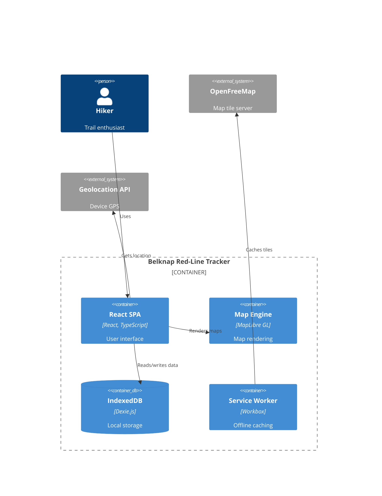

# Documentation Plan: Belknap Red-Line Tracker

This plan outlines comprehensive documentation for the Belknap Red-Line Tracker application, targeting two primary audiences: **Developer/Architects** and **Product Managers**.

---

## Documentation Structure

```
docs/
├── architecture/
│   ├── c4-diagrams/
│   │   ├── 1-context.md          # System context diagram
│   │   ├── 2-container.md        # Container diagram
│   │   ├── 3-component.md        # Component diagrams per container
│   │   └── assets/               # Mermaid source files
│   ├── data-model.md             # Entity relationships, schemas
│   ├── state-management.md       # React state, hooks architecture
│   ├── offline-first.md          # PWA, IndexedDB, service worker
│   └── decisions/                # Architecture Decision Records (ADRs)
│       ├── 001-offline-first-pwa.md
│       ├── 002-indexeddb-dexie.md
│       ├── 003-maplibre-pmtiles.md
│       └── ...
├── developer/
│   ├── getting-started.md        # Local setup, development workflow
│   ├── project-structure.md      # Directory layout, conventions
│   ├── services/                 # Service layer documentation
│   │   ├── database.md           # Dexie/IndexedDB operations
│   │   ├── geo-services.md       # Trail matching, distance calc
│   │   └── import-export.md      # CSV import/export
│   ├── hooks/                    # Custom hooks documentation
│   │   ├── overview.md
│   │   └── hook-reference.md     # All hooks with examples
│   ├── components/               # Component library
│   │   ├── map-components.md
│   │   ├── trail-components.md
│   │   └── layout-components.md
│   ├── testing.md                # Testing strategy, patterns
│   └── deployment.md             # Build, deploy, PWA setup
├── tooling/
│   ├── overview.md               # Build-time tooling overview
│   ├── gpx-parsing.md            # GPX file parsing utilities
│   ├── trail-data-generation.md  # Converting GPS tracks to trail data
│   └── loop-generation.md        # Generating loop itineraries from trails
├── product/
│   ├── overview.md               # Product vision, goals
│   ├── user-personas.md          # Target users
│   ├── use-cases/                # Detailed use case documentation
│   │   ├── UC01-track-progress.md
│   │   ├── UC02-record-hike.md
│   │   ├── UC03-view-trails.md
│   │   ├── UC04-plan-loop.md
│   │   └── ...
│   ├── features/                 # Feature documentation
│   │   ├── trail-tracking.md
│   │   ├── gps-recording.md
│   │   ├── offline-maps.md
│   │   ├── loops.md
│   │   └── ...
│   ├── user-journeys.md          # End-to-end user flows
│   └── roadmap.md                # Feature roadmap visualization
├── end-user/                     # TODO: End user documentation
│   └── (placeholder)
└── api/
    ├── data-structures.md        # TypeScript interfaces
    ├── hooks-api.md              # Hook signatures, return types
    └── services-api.md           # Service function signatures
```

---

## Phase 1: Architecture Documentation (Developer/Architect)

### 1.1 C4 Diagrams

#### Context Diagram (Level 1)
Shows the system in relation to external actors and systems.

**Scope:**
- Primary actors: Hiker (user)
- External systems: OpenFreeMap tiles, GPS/Geolocation API, Browser Storage
- System boundary: Belknap Red-Line Tracker PWA

**Content:**
```
┌─────────────────────────────────────────────────────────────┐
│                                                             │
│    ┌──────────┐         ┌──────────────────────┐           │
│    │  Hiker   │ ──────► │  Belknap Red-Line    │           │
│    │  (User)  │         │  Tracker (PWA)       │           │
│    └──────────┘         └──────────────────────┘           │
│                                   │                         │
│         ┌─────────────────────────┼─────────────────────┐   │
│         ▼                         ▼                     ▼   │
│  ┌──────────────┐   ┌──────────────────┐   ┌───────────────┐│
│  │ OpenFreeMap  │   │ Geolocation API  │   │ Browser       ││
│  │ Tile Server  │   │ (Device GPS)     │   │ IndexedDB     ││
│  └──────────────┘   └──────────────────┘   └───────────────┘│
│                                                             │
└─────────────────────────────────────────────────────────────┘
```

#### Container Diagram (Level 2)
Shows the high-level technology choices and responsibilities.

**Containers:**
| Container | Technology | Responsibility |
|-----------|------------|----------------|
| React SPA | React 18, TypeScript, Vite | UI, routing, state management |
| Map Engine | MapLibre GL JS, react-map-gl | Interactive map rendering |
| Local Database | Dexie.js (IndexedDB) | Persistent data storage |
| Service Worker | Workbox, vite-plugin-pwa | Offline caching, PWA |
| Offline Tiles | PMTiles | Vector tiles for offline maps |

#### Component Diagram (Level 3)
Detailed breakdown of React SPA container.

**Component Groups:**
1. **Pages** - Route-level components
2. **Feature Components** - TrailMap, ElevationProfile, CompletionModal
3. **Layout Components** - Layout, BottomNav
4. **Providers** - PMTilesProvider
5. **Hooks** - State management, data fetching
6. **Services** - Business logic, data access

---

### 1.2 Data Model Documentation

**Entities:**
```
┌─────────────────┐     ┌─────────────────┐     ┌─────────────────┐
│     Trail       │     │   Completion    │     │   RecordedTrack │
├─────────────────┤     ├─────────────────┤     ├─────────────────┤
│ id: string      │◄────│ trailId: string │     │ id?: number     │
│ name: string    │     │ completedAt:Date│     │ startedAt: Date │
│ distance: number│     │ notes?: string  │     │ endedAt: Date   │
│ difficulty: enum│     │ manualEntry:bool│     │ points: Point[] │
│ area: string    │     │ weather?: obj   │     │ totalDistance   │
│ coordinates: [] │     └─────────────────┘     │ matchedTrails[] │
│ elevationGain   │                             └─────────────────┘
│ trailhead: obj  │
└─────────────────┘
         │
         │ many-to-many
         ▼
┌─────────────────┐
│      Loop       │
├─────────────────┤
│ id: string      │
│ name: string    │
│ trails: Trail[] │
│ totalDistance   │
│ totalElevation  │
└─────────────────┘
```

**IndexedDB Tables:**
- `completions` - Trail completion records
- `recordedTracks` - GPS track recordings
- `settings` - User preferences

---

### 1.3 State Management Documentation

**Hook Architecture:**
```
┌───────────────────────────────────────────────────────────────┐
│                        React Components                        │
└───────────────────────────────────────────────────────────────┘
                              │
          ┌───────────────────┼───────────────────┐
          ▼                   ▼                   ▼
   ┌─────────────┐    ┌──────────────┐    ┌─────────────────┐
   │ useTrails   │    │useCompletions│    │useTrackRecording│
   │ useLoops    │    │ useProgress  │    │ useGeolocation  │
   └─────────────┘    └──────────────┘    │useTrailDetection│
          │                   │           └─────────────────┘
          │                   ▼                   │
          │           ┌──────────────┐            │
          │           │   Dexie DB   │◄───────────┘
          ▼           └──────────────┘
   ┌─────────────┐
   │ Static Data │
   │ trails.json │
   │ loops.ts    │
   └─────────────┘
```

**Key Hooks:**
| Hook | Purpose | State |
|------|---------|-------|
| `useTrails` | Trail data access | Static trail list |
| `useCompletions` | CRUD completions | IndexedDB reactive |
| `useProgress` | Completion statistics | Derived from completions |
| `useTrackRecording` | GPS track recording | Local state + IndexedDB |
| `useGeolocation` | Device GPS access | Browser Geolocation API |
| `useTrailDetection` | Real-time trail matching | Computed from track points |
| `useLoops` | Loop/itinerary data | Static + derived |

---

### 1.4 Architecture Decision Records (ADRs)

**ADR Template:**
```markdown
# ADR-XXX: Title

## Status
Accepted | Proposed | Deprecated

## Context
What is the issue that we're seeing that is motivating this decision?

## Decision
What is the change that we're proposing and/or doing?

## Consequences
What becomes easier or harder as a result?
```

**Planned ADRs:**
| ID | Title | Status |
|----|-------|--------|
| 001 | Offline-First PWA Architecture | Accepted |
| 002 | IndexedDB with Dexie.js for Local Storage | Accepted |
| 003 | MapLibre GL JS with PMTiles for Offline Maps | Accepted |
| 004 | Static Trail Data vs. Backend API | Accepted |
| 005 | React Hooks for State Management (no Redux) | Accepted |
| 006 | Tailwind CSS for Styling | Accepted |
| 007 | Vite for Build Tooling | Accepted |
| 008 | Centralized Style Configuration | Accepted |

---

## Phase 2: Developer Documentation

### 2.1 Getting Started Guide
- Prerequisites (Node.js, npm)
- Clone and install
- Development server
- Running tests
- Building for production

### 2.2 Project Structure Guide
```
src/
├── components/          # Reusable UI components
│   ├── layout/          # App shell, navigation
│   ├── map/             # Map-related components
│   └── trails/          # Trail-specific components
├── config/              # App configuration
│   └── styles.ts        # Centralized style tokens
├── data/                # Static data files
│   ├── trails.ts        # Trail definitions
│   └── loops.ts         # Loop definitions
├── hooks/               # Custom React hooks
├── pages/               # Route-level components
├── providers/           # React context providers
├── services/            # Business logic
│   ├── database/        # Dexie/IndexedDB
│   └── geo/             # Geospatial utilities
└── types/               # TypeScript definitions
```

### 2.3 Service Documentation

**Database Service (`services/database/`):**
- Dexie schema definition
- CRUD operations for completions
- Track recording persistence
- Settings management

**Geo Services (`services/geo/`):**
- `distance.ts` - Haversine distance calculation
- `trailMatcher.ts` - GPS to trail segment matching
- Coverage percentage calculation

**Import/Export Services:**
- `completionImport.ts` - CSV import parsing
- `redlineExport.ts` - BRATTS workbook export format

### 2.4 Hook Reference

Each hook documented with:
- Purpose
- Parameters
- Return value
- Usage example
- Related hooks

### 2.5 Testing Strategy

**Test Types:**
| Type | Tool | Location | Coverage |
|------|------|----------|----------|
| Unit | Vitest | `*.test.ts` | Hooks, services |
| Component | Vitest + Testing Library | `*.test.tsx` | Components |
| E2E | (future) Playwright | `/e2e` | User flows |

**Test Patterns:**
- Hook testing with `renderHook`
- Component testing with mock providers
- Service testing with mock IndexedDB

---

## Phase 3: Tooling Documentation

### 3.1 Overview

Document the build-time tooling used to prepare trail data for the application. This includes scripts and utilities that run outside the main React app.

### 3.2 GPX Parsing (`gpx-parsing.md`)

**Purpose:** Convert raw GPX files (from GPS devices or mapping software) into trail coordinate data.

**Content:**
- GPX file format overview
- Parsing library/approach used
- Coordinate extraction (lat, lng, elevation)
- Data cleaning and simplification (reducing point density)
- Handling multiple tracks/segments per file

**Example workflow:**
```
raw-gpx-files/
├── belknap-east-trail.gpx
├── gunstock-mountain.gpx
└── ...
        │
        ▼
   [GPX Parser Script]
        │
        ▼
src/data/trails.ts (coordinates array)
```

### 3.3 Trail Data Generation (`trail-data-generation.md`)

**Purpose:** Transform parsed GPS data into the `Trail` data structure used by the app.

**Content:**
- Trail metadata requirements (name, distance, difficulty, area, trailhead)
- Distance calculation from coordinates
- Elevation gain/loss calculation
- Trailhead identification (start point of trail)
- Coordinate simplification algorithms (Douglas-Peucker, etc.)
- Data validation and quality checks

**Trail data pipeline:**
```
┌─────────────────┐     ┌─────────────────┐     ┌─────────────────┐
│   GPX Files     │ ──► │  Parse & Clean  │ ──► │ Calculate Stats │
└─────────────────┘     └─────────────────┘     └─────────────────┘
                                                        │
                                                        ▼
┌─────────────────┐     ┌─────────────────┐     ┌─────────────────┐
│ src/data/       │ ◄── │  Format as TS   │ ◄── │ Add Metadata    │
│ trails.ts       │     │  Export         │     │ (name, area...) │
└─────────────────┘     └─────────────────┘     └─────────────────┘
```

### 3.4 Loop Generation (`loop-generation.md`)

**Purpose:** Generate loop itineraries by combining connected trails.

**Content:**
- Trail connectivity detection (shared endpoints)
- Loop discovery algorithm
- Combining trail data for loops:
  - Total distance calculation
  - Combined elevation profile
  - Trail ordering for logical hiking sequence
- Manual vs auto-generated loops
- Loop metadata (name, description, difficulty rating)

**Loop generation approach:**
```
┌─────────────────────────────────────────────────────────────┐
│                     Trail Network Graph                      │
│                                                             │
│    Trail A ────●──── Trail B ────●──── Trail C              │
│                │                  │                         │
│                ●                  ●                         │
│                │                  │                         │
│           Trail D ────●──── Trail E                         │
│                                                             │
└─────────────────────────────────────────────────────────────┘
                              │
                              ▼
                    [Loop Detection Algorithm]
                              │
                              ▼
┌─────────────────────────────────────────────────────────────┐
│ Detected Loops:                                             │
│   Loop 1: Trail A → Trail B → Trail E → Trail D → Trail A  │
│   Loop 2: Trail B → Trail C → ... → Trail B                 │
└─────────────────────────────────────────────────────────────┘
                              │
                              ▼
                    src/data/loops.ts
```

**Connectivity threshold:**
- Two trails are "connected" if their endpoints are within X meters
- Document the threshold used and rationale

---

## Phase 4: Product Documentation

### 4.1 Product Overview

**Vision:**
A mobile-first Progressive Web App for hikers to track their progress "red-lining" the Belknap Range trail system in New Hampshire.

**Goals:**
1. Track completion of all 50+ trail segments
2. Record GPS tracks during hikes
3. Work fully offline in the backcountry
4. Visualize progress on an interactive map
5. Plan multi-trail loop hikes

### 4.2 User Personas

**Primary Persona: The Completionist Hiker**
- Wants to hike every trail in the Belknap Range
- Tracks progress over months/years
- Values offline reliability
- Uses the app before, during, and after hikes

**Secondary Persona: The Casual Day Hiker**
- Occasional visitor to Belknap Range
- Wants to explore new trails
- Uses map to find trails near parking
- May record a track for memory/sharing

### 4.3 Use Cases

| ID | Name | Actor | Description |
|----|------|-------|-------------|
| UC01 | View Progress | Hiker | See overall completion % and stats |
| UC02 | Browse Trails | Hiker | Filter/search trail list by area, difficulty |
| UC03 | View Trail Detail | Hiker | See trail info, elevation profile, map location |
| UC04 | Mark Trail Complete | Hiker | Manually log a trail completion |
| UC05 | Record Hike | Hiker | GPS track a hike with auto-detection |
| UC06 | View Track History | Hiker | Review past recorded tracks |
| UC07 | Plan Loop Hike | Hiker | Browse and select pre-built loop itineraries |
| UC08 | View Loop on Map | Hiker | See loop trails highlighted on map |
| UC09 | Export Progress | Hiker | Download completion data as CSV |
| UC10 | Import Progress | Hiker | Import completion data from CSV |
| UC11 | Use Offline | Hiker | Full functionality without network |

**Use Case Detail Template:**
```markdown
## UC01: View Progress

**Actor:** Hiker
**Preconditions:** App is loaded
**Trigger:** User navigates to Progress page (home)

**Main Flow:**
1. System displays overall completion percentage
2. System shows trails completed vs total
3. System shows total distance hiked
4. System displays progress bar visualization
5. System lists recent completions

**Alternate Flows:**
- A1: No completions yet → Show "Get Started" guidance

**Postconditions:** User understands their progress
```

### 4.4 Feature Documentation

Each feature documented with:
- Feature name and description
- User value / problem solved
- Screenshots / mockups
- Technical implementation notes
- Related features
- Future enhancements

**Features to Document:**
1. Progress Dashboard
2. Trail List & Filtering
3. Trail Detail Page
4. Interactive Map
5. Trail Click/Tap Interaction
6. GPS Track Recording
7. Auto Trail Detection
8. Loop Itineraries
9. Offline Maps
10. Data Import/Export
11. Safety Reminders

### 4.5 User Journeys

**Journey 1: First-Time User**
```
Landing → View Progress (0%) → Browse Trails → Select Trail →
View on Map → Go Hiking → Return → Mark Complete → View Progress (2%)
```

**Journey 2: Recording a Hike**
```
Open App → Navigate to Map → Start Recording → Hike Trail(s) →
Stop Recording → Confirm Detected Trails → View in Track History
```

**Journey 3: Planning a Loop**
```
Browse Loops → Select Loop → View Details → View on Map →
Check Elevation Profile → Go Hiking → Mark Trails Complete
```

### 4.6 Roadmap Visualization

**Completed Features:**
- [x] Progress tracking dashboard
- [x] Trail list with filtering
- [x] Interactive map
- [x] GPS track recording
- [x] Auto trail detection
- [x] Offline PWA support
- [x] Loop itineraries
- [x] Trail/Loop "View on Map"
- [x] Map trail click interaction
- [x] Centralized style config

**Planned Features:**
- [ ] Area tags on trail cards (#1)
- [ ] Progress by area (#1)
- [ ] Trail detail page enhancements (#4)
- [ ] Custom trip builder (#6)
- [ ] White-label support (#5)
- [ ] Gamification/achievements

---

## Phase 5: End User Documentation (TODO)

> **Note:** This phase is planned but not yet defined. End user documentation will include:
> - Getting started guide for new users
> - Feature tutorials with screenshots
> - FAQ / Troubleshooting
> - Offline usage guide
> - Data backup and restore instructions

---

## Phase 6: API Documentation

### 6.1 TypeScript Interfaces

Document all types in `src/types/`:
- `Trail` interface
- `Completion` interface
- `RecordedTrack` interface
- `Loop` interface
- Enum types (Difficulty, etc.)

### 6.2 Hooks API Reference

For each hook:
```typescript
/**
 * useTrails - Access trail data
 *
 * @returns {Object}
 *   - trails: Trail[] - All trails
 *   - getTrailById: (id: string) => Trail | undefined
 *   - trailsByArea: Map<string, Trail[]>
 *
 * @example
 * const { trails, getTrailById } = useTrails()
 * const trail = getTrailById('belknap-east')
 */
```

### 6.3 Services API Reference

Document function signatures, parameters, return types, and examples for:
- Database operations
- Geo calculations
- Import/Export functions

---

## Documentation Tools & Format

**Format:** Plain Markdown files in `docs/` directory (no static site generator)

**Tools:**
| Purpose | Tool |
|---------|------|
| Diagrams | Mermaid.js (embedded in Markdown) |
| API Docs | TypeDoc (optional, generated from TSDoc) |
| Viewing | GitHub Markdown rendering / IDE preview |

**Mermaid Example (C4 Container):**


---

## Implementation Priority

### High Priority (Core Understanding)
1. C4 Context & Container diagrams
2. Data model documentation
3. Getting started guide
4. Product overview & user personas
5. Tooling overview (GPX parsing, loop generation)

### Medium Priority (Developer Depth)
6. Component diagram
7. Hook reference
8. Service documentation
9. Use case documentation
10. Tooling deep-dives

### Lower Priority (Polish)
11. ADRs
12. User journeys
13. Full feature documentation
14. API reference (consider auto-generation)
15. End user documentation (TODO - future)

---

## Estimated Effort

| Phase | Documents | Effort |
|-------|-----------|--------|
| Phase 1: Architecture | 8-10 docs | 1-2 days |
| Phase 2: Developer | 10-12 docs | 1-2 days |
| Phase 3: Tooling | 4 docs | 0.5-1 day |
| Phase 4: Product | 15-20 docs | 2-3 days |
| Phase 5: End User | TBD | TBD |
| Phase 6: API | 3-5 docs | 0.5-1 day |
| **Total** | **~45 docs** | **5-9 days** |

---

## Next Steps

1. **Approve this plan** - Confirm structure and priorities
2. **Create docs/ directory structure**
3. **Start with C4 diagrams** - Visual architecture overview
4. **Generate API docs** - TypeDoc from existing code
5. **Write product overview** - Foundation for PM docs
6. **Iterate** - Add detail based on feedback

---

## Questions for Stakeholder Review

1. ~~Should we use a documentation static site generator (Docusaurus/VitePress) or keep as Markdown in repo?~~ **Decided: Plain Markdown**
2. Are there specific features that need deeper documentation?
3. Should API docs be auto-generated from TypeDoc comments?
4. ~~Any specific audience beyond dev/architect and PM (e.g., contributors, end users)?~~ **Decided: End user docs added as TODO**
5. ~~Preferred diagram format: Mermaid (in-markdown) vs external tool (Lucidchart, etc.)?~~ **Decided: Mermaid**
