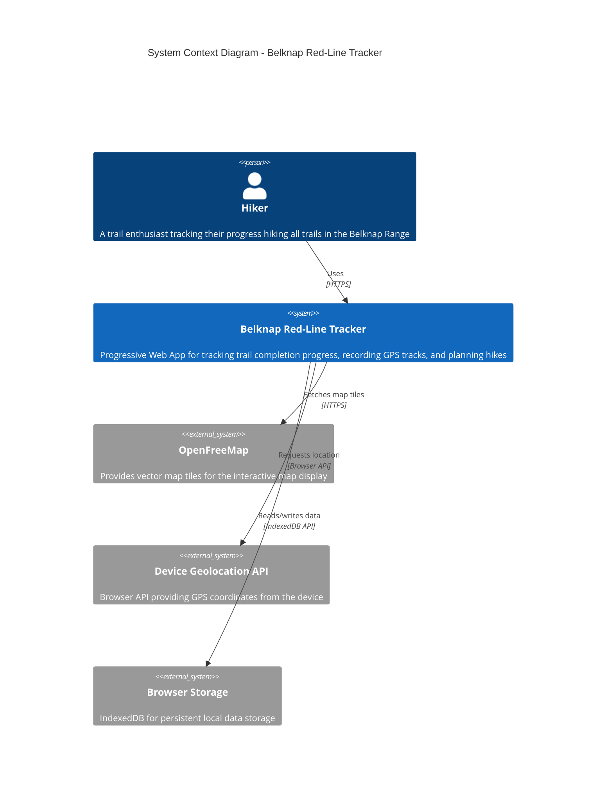

# C4 Context Diagram - Belknap Red-Line Tracker

## Overview

The Context diagram shows the highest-level view of the system, illustrating how the Belknap Red-Line Tracker fits into its environment and interacts with users and external systems.

## Diagram

## Elements

### People

| Element | Description |
|---------|-------------|
| **Hiker** | Primary user of the application. A trail enthusiast who wants to track their progress "red-lining" (hiking every trail) in the Belknap Range. May use the app before, during, and after hikes. |

### Systems

| Element | Type | Description |
|---------|------|-------------|
| **Belknap Red-Line Tracker** | Internal | The main application - a Progressive Web App (PWA) that runs entirely in the browser. Provides trail tracking, GPS recording, offline maps, and progress visualization. |
| **OpenFreeMap** | External | Free, open-source map tile server. Provides vector tiles in the OpenMapTiles schema for rendering the interactive map. Can be cached for offline use. |
| **Device Geolocation API** | External | Browser-native API for accessing the device's GPS/location services. Used for real-time position tracking during hike recording. |
| **Browser Storage** | External | IndexedDB browser storage API. Used via Dexie.js for persisting user data (completions, recorded tracks, settings) locally on the device. |

## Key Characteristics

### Offline-First Architecture

The system is designed to work fully offline after initial load:

- **Map tiles** are cached via Service Worker for offline access
- **Trail data** is bundled with the application
- **User data** is stored locally in IndexedDB
- **No backend server** is required for core functionality

### Privacy by Design

- All user data remains on the user's device
- No user accounts or authentication required
- No analytics or tracking
- GPS data never leaves the device

### PWA Capabilities

- Installable on mobile devices
- Works offline
- App-like experience with bottom navigation
- Responsive design for mobile and desktop

## Relationships

| From | To | Description |
|------|-----|-------------|
| Hiker → Tracker | Uses the web app via HTTPS to track hiking progress, record GPS tracks, and plan hikes |
| Tracker → OpenFreeMap | Fetches vector map tiles for rendering the interactive map. Tiles are cached for offline use |
| Tracker → Geolocation API | Requests device location for real-time position display and GPS track recording |
| Tracker → Browser Storage | Persists and retrieves user data (completions, tracks, settings) via IndexedDB |

## Next Level

See [Container Diagram](./2-container.md) for the next level of detail showing the major containers within the Belknap Red-Line Tracker system.
