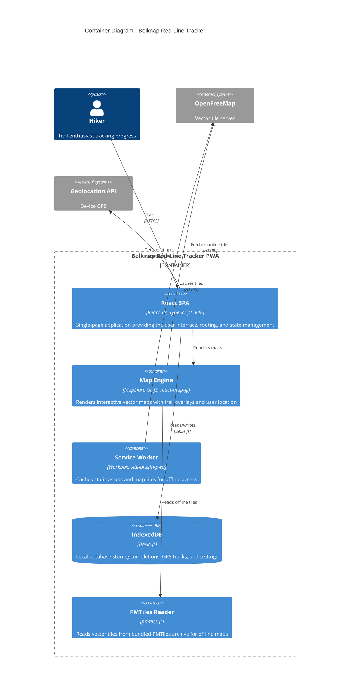

# C4 Container Diagram - Belknap Red-Line Tracker

## Overview

The Container diagram shows the high-level shape of the software architecture and how responsibilities are distributed. It also shows the major technology choices and how the containers communicate.

## Diagram



## Containers

### React SPA

| Attribute | Value |
|-----------|-------|
| **Technology** | React 19, TypeScript, Vite |
| **Purpose** | Main application shell providing UI, routing, and state management |
| **Key Libraries** | react-router-dom, Tailwind CSS |

**Responsibilities:**
- Renders all user interface components
- Manages application routing (Progress, Map, Trails, Loops, Settings)
- Coordinates state through custom React hooks
- Handles user interactions and form submissions

### Map Engine

| Attribute | Value |
|-----------|-------|
| **Technology** | MapLibre GL JS, react-map-gl |
| **Purpose** | Interactive map rendering with trail visualization |
| **Key Libraries** | maplibre-gl, react-map-gl |

**Responsibilities:**
- Renders vector map tiles (online or offline)
- Displays trail lines with completion status colors
- Shows user location marker and accuracy circle
- Handles map interactions (pan, zoom, trail click)
- Displays popups for trail information

### Service Worker

| Attribute | Value |
|-----------|-------|
| **Technology** | Workbox, vite-plugin-pwa |
| **Purpose** | Enables offline functionality through caching |
| **Strategy** | Precache static assets, runtime cache for tiles |

**Responsibilities:**
- Precaches application shell (HTML, JS, CSS)
- Caches map tile requests for offline use
- Serves cached resources when offline
- Manages cache versioning and updates

### IndexedDB (via Dexie.js)

| Attribute | Value |
|-----------|-------|
| **Technology** | IndexedDB with Dexie.js wrapper |
| **Purpose** | Persistent local storage for user data |
| **Database** | `BelknapTracker` |

**Tables:**

| Table | Primary Key | Indexes | Purpose |
|-------|-------------|---------|---------|
| `completions` | `++id` (auto) | `trailId`, `completedAt` | Trail completion records |
| `tracks` | `++id` (auto) | `startedAt`, `endedAt` | Recorded GPS tracks |

**Responsibilities:**
- Stores trail completion records
- Stores GPS track recordings
- Provides reactive queries via `useLiveQuery`
- Handles schema migrations

### PMTiles Reader

| Attribute | Value |
|-----------|-------|
| **Technology** | pmtiles.js, @protomaps/basemaps |
| **Purpose** | Offline vector tile access |
| **File** | Bundled `.pmtiles` archive |

**Responsibilities:**
- Reads vector tiles from PMTiles archive
- Provides tile data to MapLibre GL
- Enables fully offline map rendering
- Falls back to online tiles when PMTiles unavailable

## Technology Stack Summary

```
┌─────────────────────────────────────────────────────────────────┐
│                        User Interface                            │
├─────────────────────────────────────────────────────────────────┤
│  React 19  │  React Router 7  │  Tailwind CSS 4  │  TypeScript  │
├─────────────────────────────────────────────────────────────────┤
│                         Map Rendering                            │
├─────────────────────────────────────────────────────────────────┤
│     MapLibre GL JS     │     react-map-gl     │     PMTiles     │
├─────────────────────────────────────────────────────────────────┤
│                        Data & Storage                            │
├─────────────────────────────────────────────────────────────────┤
│      Dexie.js (IndexedDB)      │      Service Worker (Workbox)  │
├─────────────────────────────────────────────────────────────────┤
│                         Build Tools                              │
├─────────────────────────────────────────────────────────────────┤
│        Vite 7        │      vite-plugin-pwa      │    Vitest    │
└─────────────────────────────────────────────────────────────────┘
```

## Data Flow

### Online Mode

```
User → React SPA → Map Engine → OpenFreeMap (tiles)
                 → IndexedDB (user data)
                 → Geolocation API (GPS)
```

### Offline Mode

```
User → React SPA → Map Engine → PMTiles Reader (cached tiles)
                 → IndexedDB (user data)
                 → Geolocation API (GPS)
     → Service Worker intercepts all requests
```

## Key Design Decisions

| Decision | Rationale |
|----------|-----------|
| **Client-side only** | No backend required; privacy-preserving; works in remote areas |
| **IndexedDB via Dexie** | Robust local storage with reactive queries; handles large GPS tracks |
| **MapLibre GL JS** | Open-source; vector tiles; smooth interactions; offline capable |
| **PMTiles** | Single-file tile archive; no tile server needed for offline |
| **Workbox PWA** | Industry-standard service worker tooling; reliable caching |

## Next Level

See [Component Diagram](./3-component.md) for the next level of detail showing the internal components of the React SPA.
