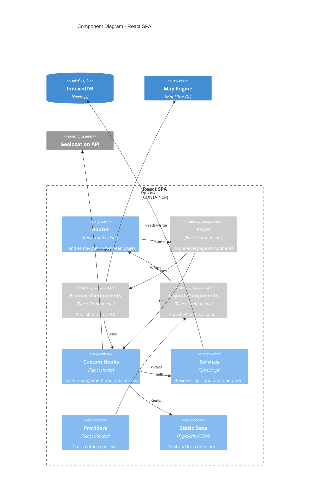
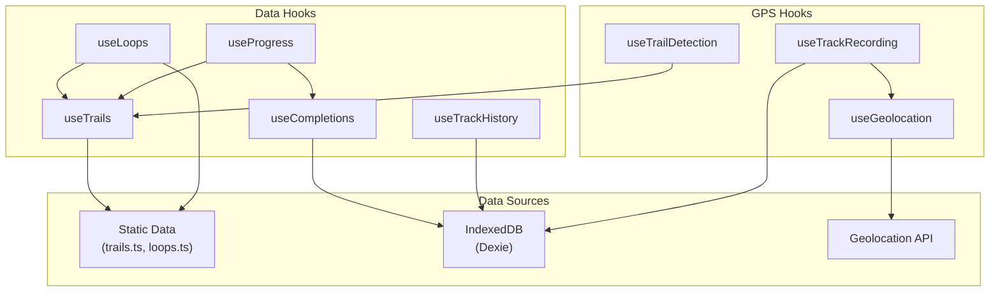

# C4 Component Diagram - Belknap Red-Line Tracker

## Overview

The Component diagram shows the internal structure of the React SPA container, breaking it down into its major components and their interactions.

## Diagram



## Component Groups

### Pages (`src/pages/`)

Route-level components that compose the main views of the application.

| Component | Route | Description |
|-----------|-------|-------------|
| `ProgressPage` | `/` | Dashboard showing overall completion progress and stats |
| `MapPage` | `/map` | Full-screen interactive trail map |
| `TrailsPage` | `/trails` | Searchable, filterable list of all trails |
| `TrailDetailPage` | `/trails/:id` | Individual trail details with elevation profile |
| `LoopsPage` | `/loops` | List of pre-built loop itineraries |
| `LoopDetailPage` | `/loops/:id` | Loop details with combined elevation profile |
| `TrackHistoryPage` | `/tracks` | List of recorded GPS tracks |
| `TrackDetailPage` | `/tracks/:id` | Individual track playback and details |
| `TimelinePage` | `/timeline` | Chronological completion history |
| `SettingsPage` | `/settings` | App settings, data import/export |

### Feature Components (`src/components/`)

Reusable UI components for specific features.

```
components/
├── map/
│   └── TrailMap.tsx         # Interactive map with trails, location, recording
├── trails/
│   ├── ElevationProfile.tsx # SVG elevation chart
│   └── CompletionModal.tsx  # Mark trail complete dialog
├── layout/
│   ├── Layout.tsx           # App shell with header
│   └── BottomNav.tsx        # Mobile bottom navigation
├── ErrorBoundary.tsx        # React error boundary
└── SafetyDisclaimerModal.tsx # First-time safety warning
```

| Component | Purpose |
|-----------|---------|
| `TrailMap` | Core map component with trail layers, location tracking, GPS recording |
| `ElevationProfile` | SVG-based elevation chart for trails and loops |
| `CompletionModal` | Dialog for marking trails complete with optional notes |
| `Layout` | App shell providing consistent header and page structure |
| `BottomNav` | Mobile-friendly bottom tab navigation |
| `SafetyDisclaimerModal` | One-time safety disclaimer for new users |

### Custom Hooks (`src/hooks/`)

React hooks encapsulating state management and data access logic.



| Hook | Purpose | Data Source |
|------|---------|-------------|
| `useTrails` | Access trail data, lookup by ID | Static `trails.ts` |
| `useLoops` | Access loop data with resolved trails | Static `loops.ts` + `useTrails` |
| `useCompletions` | CRUD operations for completions | IndexedDB via Dexie |
| `useProgress` | Derived completion statistics | `useTrails` + `useCompletions` |
| `useTrackHistory` | List and manage recorded tracks | IndexedDB via Dexie |
| `useGeolocation` | Device GPS position subscription | Browser Geolocation API |
| `useTrackRecording` | GPS track recording lifecycle | `useGeolocation` + IndexedDB |
| `useTrailDetection` | Real-time trail matching from GPS | Track points + trail data |

### Services (`src/services/`)

Business logic and data operations separated from React components.

```
services/
├── database/
│   ├── db.ts              # Dexie database instance and schema
│   └── index.ts           # Database exports
├── geo/
│   ├── distance.ts        # Haversine distance calculation
│   ├── trailMatcher.ts    # GPS point to trail matching
│   └── index.ts           # Geo exports
├── completionImport.ts    # CSV import parsing
└── redlineExport.ts       # BRATTS workbook CSV export
```

| Service | Purpose |
|---------|---------|
| `db.ts` | Dexie database instance with schema for completions and tracks |
| `distance.ts` | Haversine formula for GPS coordinate distance calculation |
| `trailMatcher.ts` | Algorithm for matching GPS track points to trail segments |
| `completionImport.ts` | Parse CSV files to import completion data |
| `redlineExport.ts` | Generate CSV export in BRATTS workbook format |

### Providers (`src/providers/`)

React Context providers for cross-cutting concerns.

| Provider | Purpose |
|----------|---------|
| `PMTilesProvider` | Manages offline tile loading, provides map style config |

### Static Data (`src/data/`)

Bundled trail and loop definitions.

| File | Contents |
|------|----------|
| `trails.ts` | All trail definitions with coordinates, metadata |
| `loops.ts` | Pre-built loop itineraries referencing trail IDs |

## Component Interaction Flow

### Viewing Progress

```
ProgressPage
    └── useProgress()
            ├── useTrails() → trails.ts
            └── useCompletions() → IndexedDB
                    └── Returns: { total, completed, percentage, ... }
```

### Recording a Hike

```
MapPage
    └── TrailMap
            ├── useGeolocation() → Geolocation API
            ├── useTrackRecording()
            │       ├── Collects GPS points
            │       └── Saves to IndexedDB
            └── useTrailDetection()
                    └── Matches points to trails in real-time
```

### Marking Trail Complete

```
TrailDetailPage
    └── CompletionModal
            └── useCompletions().addCompletion()
                    └── Writes to IndexedDB
```

## Key Design Patterns

### Hooks as State Management

Instead of a global state library (Redux, Zustand), state is managed through specialized hooks:

- **Data hooks** wrap data sources with React-friendly interfaces
- **Derived hooks** compose multiple data sources (e.g., `useProgress` uses `useTrails` + `useCompletions`)
- **Effect hooks** manage subscriptions and side effects (e.g., `useGeolocation`)

### Separation of Concerns

```
Pages (composition)
  → Feature Components (UI)
    → Hooks (state)
      → Services (logic)
        → Data (storage)
```

### Colocation

- Each feature has its components, hooks, and services colocated
- Shared utilities live in `services/` and `hooks/`
- Types are centralized in `types/`

## Next Steps

- See [Data Model](../data-model.md) for entity relationships
- See [State Management](../state-management.md) for hook patterns
- See [Developer Guide](../../developer/getting-started.md) for setup instructions
