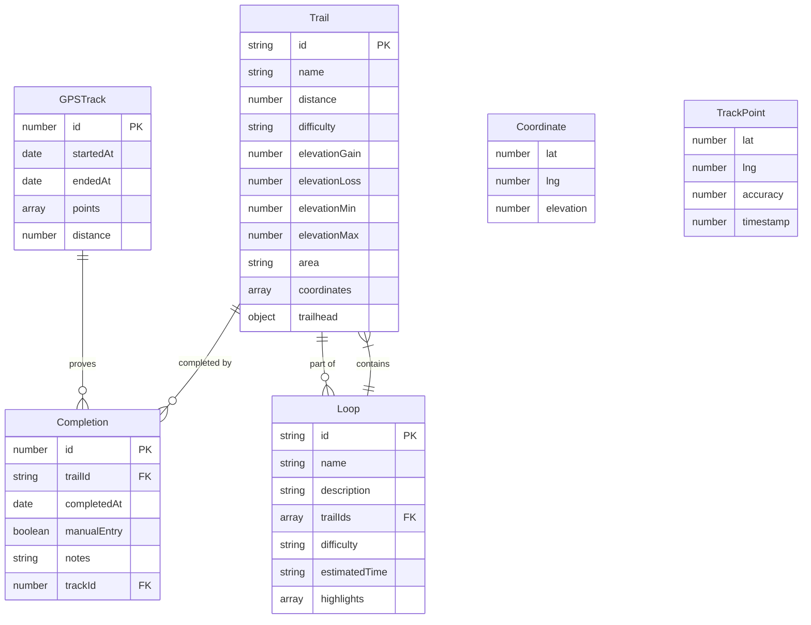

# Data Model - Belknap Red-Line Tracker

## Overview

The application uses two types of data storage:

1. **Static Data** - Trail and loop definitions bundled with the application
2. **User Data** - Completions and GPS tracks stored in IndexedDB

## Entity Relationship Diagram



## Entities

### Trail

Represents a single trail segment in the Belknap Range.

**Source:** Static data in `src/data/trails.ts`

```typescript
interface Trail {
  id: string              // Unique identifier (e.g., "belknap-east")
  name: string            // Display name (e.g., "East Trail")
  distance: number        // Length in miles
  elevationGain?: number  // Total feet climbed
  elevationLoss?: number  // Total feet descended
  elevationMin?: number   // Lowest point in feet
  elevationMax?: number   // Highest point in feet
  difficulty: 'easy' | 'moderate' | 'difficult'
  coordinates: Coordinate[]  // GPS path of the trail
  trailhead: { lat: number; lng: number }  // Starting point
  area?: string           // Region (e.g., "Belknap Mountain")
}
```

**Example:**
```json
{
  "id": "belknap-east",
  "name": "East Trail",
  "distance": 1.2,
  "elevationGain": 850,
  "elevationLoss": 50,
  "elevationMin": 1100,
  "elevationMax": 1900,
  "difficulty": "moderate",
  "area": "Belknap Mountain",
  "trailhead": { "lat": 43.5123, "lng": -71.3456 },
  "coordinates": [
    { "lat": 43.5123, "lng": -71.3456, "elevation": 1100 },
    { "lat": 43.5134, "lng": -71.3445, "elevation": 1200 },
    // ... more points
  ]
}
```

### Coordinate

A single point along a trail path.

```typescript
interface Coordinate {
  lat: number        // Latitude in decimal degrees
  lng: number        // Longitude in decimal degrees
  elevation?: number // Elevation in feet above sea level
}
```

### Completion

Records that a user has completed a specific trail.

**Source:** IndexedDB `completions` table via Dexie.js

```typescript
interface Completion {
  id?: number         // Auto-generated primary key
  trailId: string     // Reference to Trail.id
  completedAt: Date   // When the trail was completed
  manualEntry: boolean // true if manually logged, false if from GPS
  notes?: string      // Optional user notes
  trackId?: number    // Reference to GPSTrack.id (if from recording)
}
```

**IndexedDB Schema:**
```javascript
completions: '++id, trailId, completedAt'
```

**Example:**
```json
{
  "id": 1,
  "trailId": "belknap-east",
  "completedAt": "2024-06-15T14:30:00.000Z",
  "manualEntry": false,
  "notes": "Great views from the summit!",
  "trackId": 5
}
```

### GPSTrack

A recorded GPS track from a hiking session.

**Source:** IndexedDB `tracks` table via Dexie.js

```typescript
interface GPSTrack {
  id?: number        // Auto-generated primary key
  startedAt: Date    // When recording started
  endedAt?: Date     // When recording stopped (undefined if in progress)
  points: TrackPoint[] // Array of GPS readings
  distance: number   // Total distance in meters
}
```

**IndexedDB Schema:**
```javascript
tracks: '++id, startedAt, endedAt'
```

### TrackPoint

A single GPS reading within a track.

```typescript
interface TrackPoint {
  lat: number       // Latitude in decimal degrees
  lng: number       // Longitude in decimal degrees
  accuracy: number  // GPS accuracy in meters
  timestamp: number // Unix timestamp in milliseconds
}
```

### Loop

A pre-defined hiking itinerary combining multiple trails.

**Source:** Static data in `src/data/loops.json`

```typescript
interface Loop {
  id: string           // Unique identifier
  name: string         // Display name (e.g., "Belknap Summit Loop")
  description: string  // Markdown description of the loop
  trailIds: string[]   // Ordered list of Trail.id values
  difficulty: 'easy' | 'moderate' | 'difficult'
  estimatedTime: string // Human-readable duration (e.g., "3-4 hours")
  highlights: string[] // Key features of the loop
}
```

**Example:**
```json
{
  "id": "belknap-summit-loop",
  "name": "Belknap Summit Loop",
  "description": "A classic loop over Belknap Mountain...",
  "trailIds": ["belknap-east", "belknap-summit", "belknap-carriage"],
  "difficulty": "moderate",
  "estimatedTime": "3-4 hours",
  "highlights": ["Fire tower views", "Historic carriage road"]
}
```

## Derived Types

### LoopWithDetails

Runtime type that resolves loop trail IDs to full Trail objects.

```typescript
interface LoopWithDetails extends Loop {
  trails: Trail[]        // Resolved trail objects
  totalDistance: number  // Sum of trail distances
  totalElevationGain: number // Sum of elevation gains
}
```

## Data Storage

### Static Data

| Data | File | Format | Size |
|------|------|--------|------|
| Trails | `src/data/trails.ts` | TypeScript | ~50 trails |
| Loops | `src/data/loops.json` | JSON | ~10 loops |

Static data is bundled with the application at build time and loaded synchronously.

### IndexedDB

| Table | Purpose | Typical Size |
|-------|---------|--------------|
| `completions` | Trail completion records | 50-500 records |
| `tracks` | GPS track recordings | 10-100 records, ~1000 points each |

IndexedDB provides persistent storage that survives browser restarts and works offline.

## Relationships

### Trail → Completion (One-to-Many)

A trail can have multiple completions (hiked multiple times).

```typescript
// Find all completions for a trail
const completions = await db.completions
  .where('trailId')
  .equals(trailId)
  .toArray()
```

### GPSTrack → Completion (One-to-Many)

A single GPS track recording can result in multiple trail completions.

```typescript
// Find completions from a track
const completions = await db.completions
  .where('trackId')
  .equals(trackId)
  .toArray()
```

### Loop → Trail (Many-to-Many)

Loops reference trails by ID; trails can be part of multiple loops.

```typescript
// Resolve loop trails
const loopWithDetails = {
  ...loop,
  trails: loop.trailIds.map(id => getTrailById(id)).filter(Boolean)
}
```

## Data Integrity

### Static Data Constraints

- Trail IDs must be unique
- Loop trail IDs must reference valid trails
- Coordinates must be valid GPS coordinates

### User Data Constraints

| Constraint | Enforcement |
|------------|-------------|
| `trailId` must exist | Application logic (not DB-enforced) |
| `completedAt` must be valid date | TypeScript types |
| `trackId` must exist if set | Application logic |

### Cascading Behavior

The application does not currently implement cascading deletes. If a trail is removed from static data:

- Existing completions referencing that trail remain in IndexedDB
- The `useCompletions` hook filters out orphaned completions

## Data Migration

### IndexedDB Versioning

Dexie handles schema migrations automatically:

```typescript
// Version 1: Initial schema
db.version(1).stores({
  completions: '++id, trailId, completedAt',
})

// Version 2: Added tracks table
db.version(2).stores({
  completions: '++id, trailId, completedAt',
  tracks: '++id, startedAt, endedAt',
})
```

### Backup and Restore

Users can export/import their data via Settings:

- **Export:** Downloads completions as CSV
- **Import:** Parses CSV and adds completions to IndexedDB

## See Also

- [State Management](./state-management.md) - How hooks access data
- [Database Service](../developer/services/database.md) - Dexie.js usage
- [Import/Export](../developer/services/import-export.md) - CSV handling
